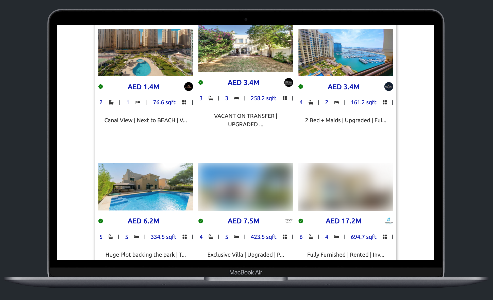
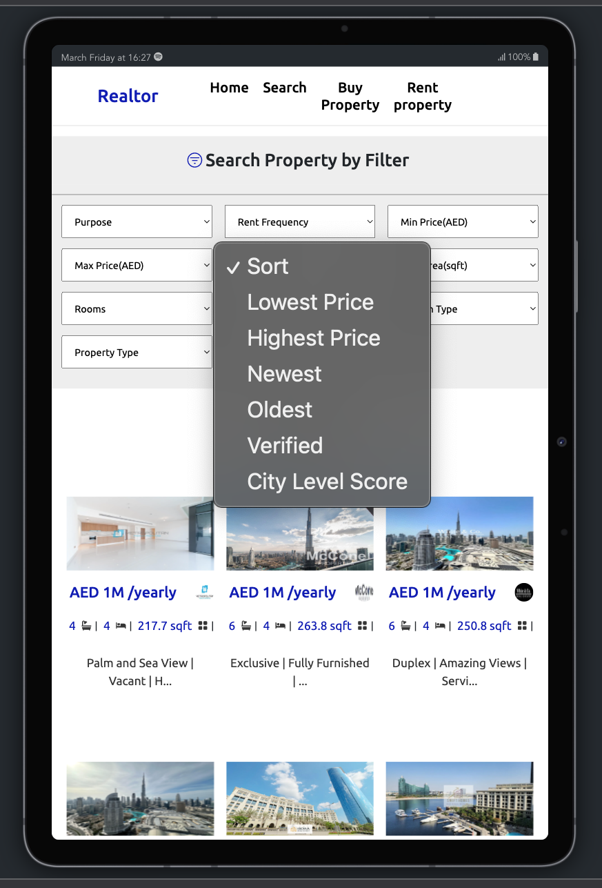
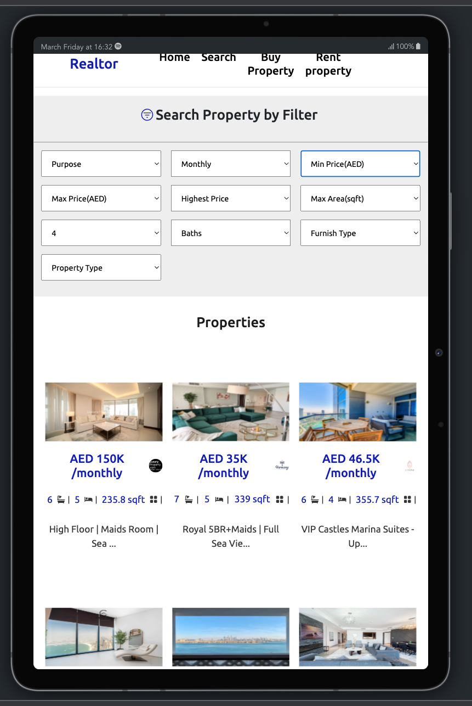
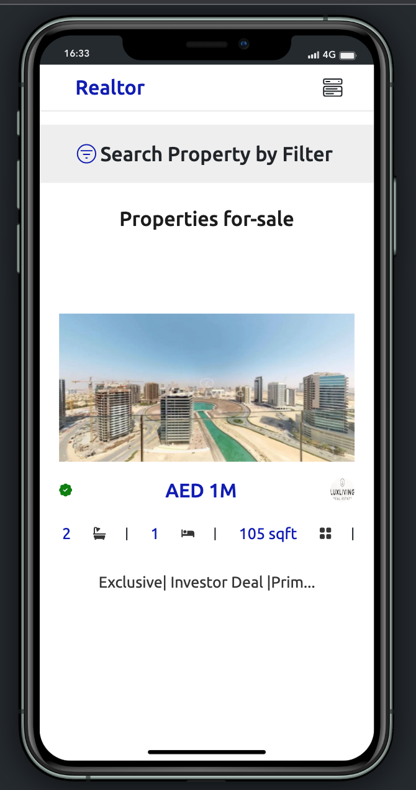
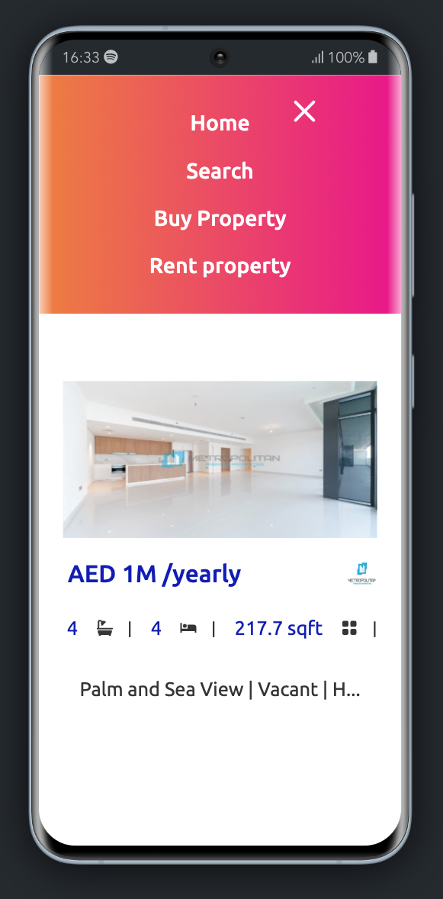

# Real Estate Web App

This is a [Next.js ](https://nextjs.org/) project bootstrapped with create-next-app.

## Live links

[Realestate-webapp](https://realestate-web-app-errytagedesign.vercel.app/).

## App Description

This is a Next.js web app that allows you to search for properties, buy or rent them, and view more details about each property by clicking on its name.

## Pages

The app has the following pages:

1. Home: This is the landing page for the app. It displays a search bar where you can search for properties, as well as a list of featured properties.

2. # Search:

   This page displays a list of properties that match your search criteria. You can filter the list by min price, max price, purpose, frequency, furniture type (furnished or unfurnished), and sort the list by lowest or highest price, newest or oldest, verified, city level score, and number of rooms.

3. # Buy Property:

   This page displays a list of properties that are available for sale. You can filter the list by min price, max price, purpose, frequency, furniture type, and sort the list as described above.

4. ### Rent Property:

   This page displays a list of properties that are available for rent. You can filter the list by min price, max price, purpose, frequency, furniture type, and sort the list as described above.

5. # Property Details:
   This page displays more details about a specific property. You can access this page by clicking on the name of a property from any of the other pages.

## Technologies Used

1. Next Js.
2. [Bootstrap](https://getbootstrap.com).
3. [REST Countries API](https://restcountries.com/)
4. [Axios](https://axios-http.com/docs/intro)
5. [Custom-Hook](https://reactjs.org/docs/hooks-custom.html)

## Features

1. Search: You can search for countries by name or partial name. The app will display a list of matching countries, along with their flags, names, and population.

2. Filtering: You can filter the list of countries by region (Africa, Americas, Asia, Europe, Oceania).

3. Read More Page: You can view more details about each country by clicking on its name. The app will display a separate page with information about the country's capital, population, currency, and languages.

4. Dark and Light Mode theme

## Preview

## Installation

To run the app locally, follow these steps:

Clone the repository: git clone https://github.com/your-username/country-search-app.git
Install the dependencies: npm install
Start the app: npm start

## Contributing

If you find any bugs or issues with the app, feel free to open a new issue on the GitHub repository. If you would like to contribute to the project, you can fork the repository and submit a pull request with your changes.
